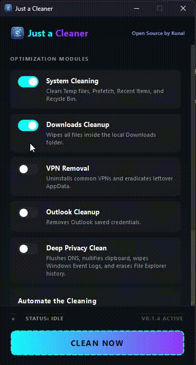

# 🧹 Just a Cleaner

> The definitive, lightweight Windows cleaner built for privacy, sustained performance, and absolute transparency.

<div align="center">
  
</div>

---

## 🚀 Overview

We live our digital lives on our PCs, and over time, Windows silently accumulates massive amounts of junk and highly sensitive traces. Temporary files clog up your storage, DNS requests expose your browsing history, and uninstalled VPNs stubbornly leave their private configurations buried deep in hidden `AppData` folders.

Cleaning this manually is tedious. Most commercial tools available today are bloated with features you don't need, aggressively invasive, or irritatingly unclear about what they are *actually* deleting.

**Just a Cleaner** solves this with a simple, unwavering promise:
➡️ *Deep, intelligent system cleaning — absolutely zero bloat, no gimmicks, and complete transparency.*

---

## 🎥 Demo

<div align="center">
  
</div>

---

## ✨ Core Features

### 🧹 Deep System Purge
* **Clears Windows Temp Folders**: Automatically obliterates gigabytes of forgotten application cache and installer leftovers.
* **Empties Prefetch & Recent Items**: Destroys the tracking caches that monitor what files and applications you open.
* **Recycle Bin Sweep**: Instantly reclaims physical disk space without prompts.

### 🔒 Privacy Protection
* **Flushes DNS Cache**: Wipes your local cache of visited websites, preventing local snooping of your digital footprint.
* **Wipes Clipboard History**: Force-clears the native Windows WinRT Clipboard (Win+V) so your securely copied passwords and private messages aren't left exposed.
* **Removes File Explorer Paths**: Erases the typed repository of every folder you have ever searched for or visited.
* **Clears Event Logs**: Suppresses and deletes system-level diagnostic tracking logs.

### 🛡️ VPN Residue Eradicator
Uninstalling a VPN is rarely enough—most leave their secret configurations behind. This tool proactively detects and permanently erases leftover application data for:
* **Tailscale**
* **NordVPN**
* **ProtonVPN**

### ⏱️ Smart, Invisible Automation
* **Seamless Windows Integration**: Directly connects to the native Windows Task Scheduler via Python.
* Choose to run it automatically:
  * **On Startup** (Every time you boot)
  * **On Interval** (E.g., Every 6 hours)
  * **On Resume** (Every time you wake the PC from sleep)
* Runs completely silently in the background—set it and forget it.

---

## ⚡ Why Choose Just a Cleaner?

**Most system cleaners today:**
* ❌ Are heavily bloated with annoying pop-ups.
* ❌ Hide what they really delete behind "Magic Clean" buttons.
* ❌ Feel invasive, ad-heavy, and untrustworthy.

**Just a Cleaner is drastically different:**
* ✅ **Lightweight & Blazing Fast:** Designed optimally to run its sequence in seconds.
* ✅ **Fully Transparent:** You see exact, real-time diagnostic progress on the interface.
* ✅ **Focused & Unintrusive:** Does exactly what it says and nothing else.
* ✅ **Built for the Privacy-Conscious:** Specifically targets local history and registries that expose you.

---

## 📊 What Actually Gets Cleaned?

| Category | Direct Impact | Privacy Benefit |
| :--- | :--- | :--- |
| **Temp Files** | Reclaims gigabytes of C: Drive storage | Removes fragmented tracking data |
| **Clipboard** | Destroys the OS-level clipboard history | Prevents password and text scraping |
| **DNS Cache** | Speeds up stale network lookup issues | Hides network lookup history |
| **Explorer Logs** | Resets File Explorer typed paths | Prevents visual snooping of user habits |
| **Event Logs** | Clears Windows system activity logs | Stops deep administrative tracking |
| **VPN Data** | Eradicates hidden AppData configurations | Wipes user-specific tunnel data |

---

## 📥 Download & Installation

The fastest way to get started is downloading our compiled, ready-to-run setup wizard. The installer seamlessly handles everything and automatically configures the application safely on your Windows machine.

👉 **[Download JustACleaner_Setup.exe](https://github.com/Kunal-D-Droid/justacleaner/releases/latest/download/JustACleaner_Setup.exe)**

*(Feel free to browse past versions in the [Releases](https://github.com/Kunal-D-Droid/justacleaner/releases) section.)*

**Getting Started:**
1. Run the `JustACleaner_Setup.exe` file.
2. Complete the simple 3-step installation wizard.
3. Launch **Just a Cleaner** and hit "Clean Now"!

---

## 🛠️ Built With

* **Python** → Core logic & high-performance system operations
* **PyQt6** → A beautifully fluid, heavily customized neon-dark user interface
* **WinRT / PowerShell** → Deep OS-level integrations allowing true administrative erasure

---

## 🤝 Contributing

Contributions are heavily encouraged! Whether it's improving algorithmic performance, adding new application cleaning modules, or fixing graphical bugs, your input is incredibly welcome.

**To get started:**
```bash
git clone https://github.com/Kunal-D-Droid/justacleaner.git
cd justacleaner
git checkout -b feature/your-awesome-feature
```

**Next steps:**
1. Make your modular changes.
2. Test thoroughly on your system.
3. Commit (`git commit -m "Added aggressive browser cache clearing"`)
4. Push & open a Pull Request!

---

## 🔐 Privacy Guarantee

* **Zero tracking.**
* **Zero telemetry.**
* **Zero hidden background bloat.**
* Everything runs strictly and safely on your local machine.

---

## 👤 Author & License

Built with extreme focus by **[Kunal](https://www.kunaldas.tech)**.

Licensed under the **GNU GENERAL PUBLIC LICENSE**.

---
💡 *Keep your system clean. Keep your data private. Stay fundamentally in control.*
